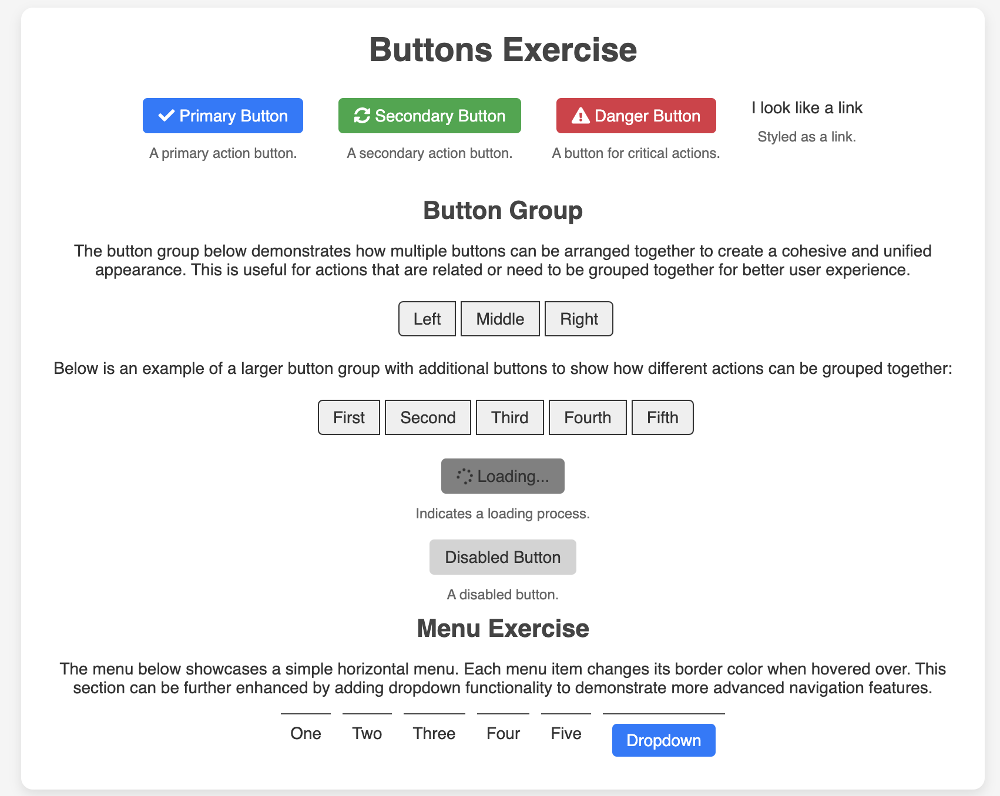

# Button Exercise

## Description
This project showcases various button styles and functionalities using HTML, CSS, and JavaScript. It demonstrates interactive features, tooltips, and a responsive design.

## Features
- **Styled Buttons:** Includes primary, secondary, and danger buttons with hover effects and icons.
- **Button Groups:** Shows how to arrange multiple buttons in a cohesive group.
- **Responsive Menu:** A horizontal menu with dropdown functionality.
- **JavaScript Interactivity:** Toggles content visibility on button click.
- **Loading and Disabled States:** Demonstrates buttons in loading and disabled states.
- **Tooltips:** Provides additional information on hover.

## Installation
1. Clone the repository:
   ```bash
   git clone https://github.com/leeluush/Button.git

## Usage
Click the buttons to see various interactions and styles.

## Screenshots

